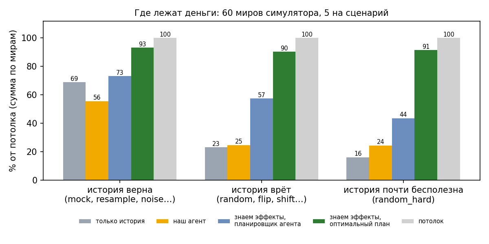
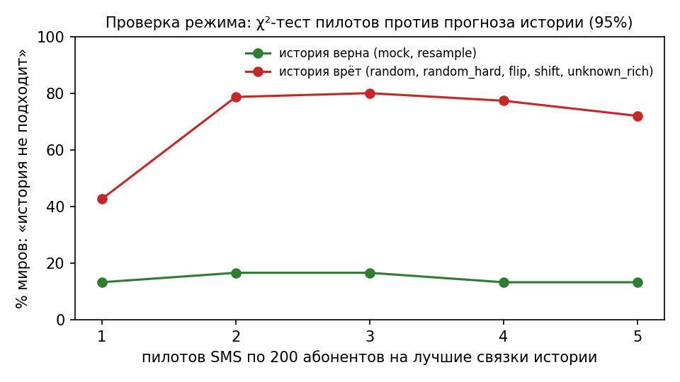
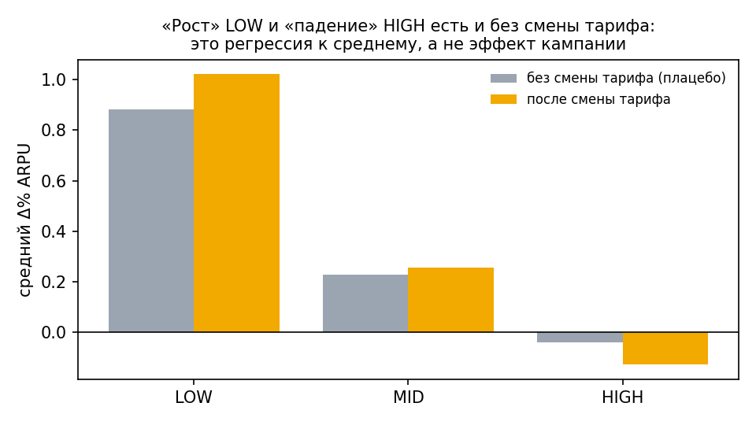

# sim/ — симулятор миров: где агент зарабатывает и где теряет

Эффекты на судействе другие, чем в мок-среде. Поэтому агента настраиваем не на мок, а на наборе
«возможных миров»: в каждом свои истинные эффекты смен тарифа. Результат во всех мирах считается кодом
организаторов (`environment.py`, `scoring_core.py`).

```bash
cd beeline_agent
python -m sim.worlds --check                                   # проверка генератора, ~5 с
python -m sim.headroom --worlds 5 --scenarios all --jobs 4 --milp  # где лежат деньги, ~3 мин
python -m sim.hypotheses --worlds 15 --scenarios all --jobs 4 --grid "RISK_K=1.0,0.0"  # сетка гипотез
python prior/regime.py --worlds 15                              # калибровка проверки режима по пилотам
python -m sim.charts                                            # графики для README
```

## Миры (`worlds.py`)

`make_world(seed, scenario)` → истинная модель эффектов + fallback-правило. Один и тот же seed всегда даёт
тот же мир. 12 сценариев:

| Группа | Сценарии | Что в них |
|---|---|---|
| история верна | `mock`, `resample`, `noise`, `high_rich`, `stingy`, `causal` | мок организаторов; бутстрэп истории; шум; другие уровни эффектов |
| история врёт | `random`, `random_soft`, `flip`, `shift`, `unknown_rich` | сдвиг уровней, частичный перенос контрастов, смена знака, перестановка целей, лучшие цели без истории |
| история почти бесполезна | `random_hard` | ближе всего к ТЗ: без разведки результат в разы меньше, чем со знанием эффектов (на 180 мирах — в 8 раз; в ТЗ — в ~15) |

## Где лежат деньги (`headroom.py`, `optimizer.py`)



Разрыв между агентом и потолком раскладывается по причинам (60 миров, сумма, млн):

| Только история | Агент | Знаем эффекты, планировщик агента | + лучший канал | Знаем эффекты, оптимальный план | Потолок |
|---:|---:|---:|---:|---:|---:|
| 154.6 | 136.1 | 216.0 | 226.1 | **308.6** | 335.8 |

- **Незнание эффектов — 40% разрыва** (агент → «знаем эффекты»). Это пилоты и оценка эффекта.
- **Устройство плана — 41%.** Оптимальный план строит `optimizer.py`: целочисленная оптимизация (scipy/HiGHS) с фильтрами трафика и звонков, наборами тарифов (в том числе «каждый тариф — к своей лучшей цели») и всеми 4 каналами. Он берёт 92% потолка против 67% у планировщика агента: все 10 кампаний, почти весь охват и бюджет. Нынешний агент берёт медиану 3 кампании, ~11 000 контактов с пилотами и ~44 000 бюджета.
- **Каналы по отдельности — 5%. Запас в оценке потолка — всего 14%**: почти весь разрыв «план» можно отыграть.
- Даже без пилотов, на одних оценках истории, оптимальный план лучше планировщика агента на тех же оценках: 176.2 против 154.6 млн, лучше в 75% миров, миров в минусе 7% против 10%.
- `plan_from_lift(...)` принимает любые оценки эффекта, в том числе оценки агента после пилотов.

## Проверка режима по пилотам (`prior/regime.py`)



Для пилота считается, что он должен показать, если история верна, и с каким разбросом:

- шум пилота `0.804/√n`;
- состав выборки;
- ошибка самой истории `q_se`.

По каждому пилоту `z = (наблюдение − прогноз) / разброс`, по нескольким — `Q = Σ z²` против порога χ² (95%).
Выводы:

- **Детектор работает.** После 2–3 пилотов SMS по 200 абонентов: в мирах, где история врёт, флаг «история не подходит» поднимается в 67–93% миров. Где история верна (`mock`, `resample`) — в 13–20% (ложная тревога).
- **Жёсткое переключение рискованно.** Если при подтверждённой истории сразу ставить «только историю», в сумме по всем мирам +6%, но в мирах, где история врёт, −5%. Для `random_hard`, самого похожего на ТЗ, это −28%.
- **Разумное применение** — мягкое: при подтверждённой истории добирать неиспользованный охват и бюджет её лучшими связками.

## Регрессия к среднему в истории



Без всякой смены тарифа ARPU у LOW «растёт» на 0.88, у HIGH «падает» на 0.04. Уровень сегмента в истории — это
в основном регрессия к среднему. Поэтому история надёжна в контрастах («какая цель лучше»), а не в уровнях.
Подробно — `prior/README.md`.

## Проверки

- `python -m sim.worlds --check` — генератор. Мок совпадает с функцией организаторов, миры детерминированы, прежние миры не меняются при добавлении сценариев.
- `optimizer.py` — ценность плана по модели совпадает с подсчётом организаторов до рубля (проверено на мирах `mock`, `random`, `random_hard`).
- `hypotheses.py --jobs 4` даёт тот же результат, что и в один процесс.
